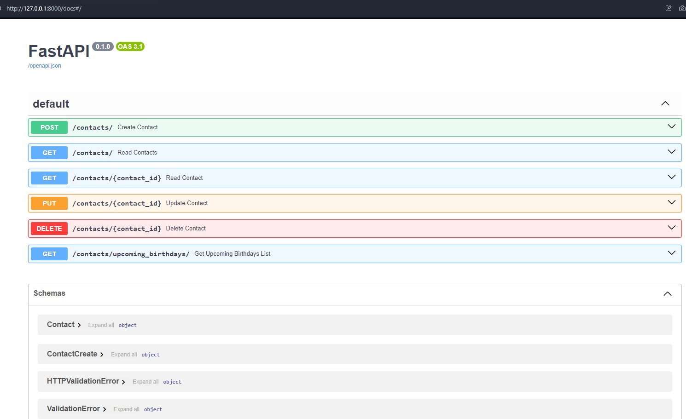

## Домашнє завдання #11
    
## Завдання 
  
Мета цього домашнього завдання — створити REST API для зберігання та управління контактами. API повинен бути побудований з використанням інфраструктури FastAPI та використовувати SQLAlchemy для управління базою даних.  

Контакти повинні зберігатися в базі даних та містити в собі наступну інформацію:  
* Ім'я
* Прізвище
* Електронна адреса
* Номер телефону
* День народження
* Додаткові дані (необов'язково)


API повинен мати можливість виконувати наступні дії:  
* Створити новий контакт
* Отримати список всіх контактів
* Отримати один контакт за ідентифікатором
* Оновити існуючий контакт
* Видалити контакт


На придачу до базового функціоналу CRUD API також повинен мати наступні функції:  

* Контакти повинні бути доступні для пошуку за іменем, прізвищем чи адресою електронної пошти (Query).     
* API повинен мати змогу отримати список контактів з днями народження на найближчі 7 днів.    

Загальні вимоги:  

1. Використання фреймворку FastAPI для створення API
2. Використання ORM SQLAlchemy для роботи з базою даних
3. В якості бази даних слід використовувати PostgreSQL.
4. Підтримка CRUD операцій для контактів
5. Підтримка зберігання дати народження контакту
6. Надання документів для API
7. Використання модуля перевірки достовірності даних Pydantic

### Порядок виконання

Щоб підняти докер-контейнер з PostgreSQL і створити в ньому базу даних postgres:  

```
docker run --name db-postgres -p 5432:5432 -e POSTGRES_PASSWORD=567234 -d postgres
```

Щоб запустити віртуальне середовище і запустити [Swagger документацію RESTful API](http://127.0.0.1:8000/docs):  

```cd contact_api``` 
```poetry shell```  
```cd contact_api```  
```uvicorn main:app --host localhost --port 8000 --reload```  


На сторінці документації можна створити контакти. Для цього перейдемо в розділ ```POST /contacts/ Create contacts``` і додамо наступні контакти:
```
{  
  "first_name": "Alice",
  "last_name": "Smith",  
  "email": "alice12@gmail.com",
  "phone_number": "1234567890",  
  "birthday": "2004-03-17",
  "additional_data": "-"
}
```
```
{   
  "first_name": "Mark", 
  "last_name": "Johnson",   
  "email": "markjsn@gmail.com", 
  "phone_number": "1234567890",   
  "birthday": "2001-03-23", 
  "additional_data": "-" 
}
```
```
{    
  "first_name": "Lily",  
  "last_name": "Rain",    
  "email": "lily@gmail.com",  
  "phone_number": "380967869876",    
  "birthday": "1999-09-20",  
  "additional_data": ""  
}
```

Далі в розділі ```GET /contacts/ Read Contacts``` можна отримати всі контакти, або ж якщо ввести в пошуковий запит ```query``` ім'я, прізвище чи електронну адресу - отримати шуканий контакт, якщо такий існує в базі даних.  
  
Далі в розділі ```GET /contacts/{contact_id} Read Contact``` можна за ідентифікатором знайти необхідний контакт.  
     
Далі в розділі ```PUT /contacts/{contact_id} Update Contact``` можна за ідентифікатором знайти необхідний контакт і оновити його дані.  
  
Далі в розділі ```DELETE /contacts/{contact_id} Delete Contact``` можна за ідентифікатором видалити контакт.

Далі в розділі ```GET /contacts/upcoming_birthdays/ Get Upcoming Birthdays List``` можна отримати список контактів з днями народження на найближчі 7 днів


## Результат   

[Swagger документація RESTful API:](http://127.0.0.1:8000/docs)  
  

