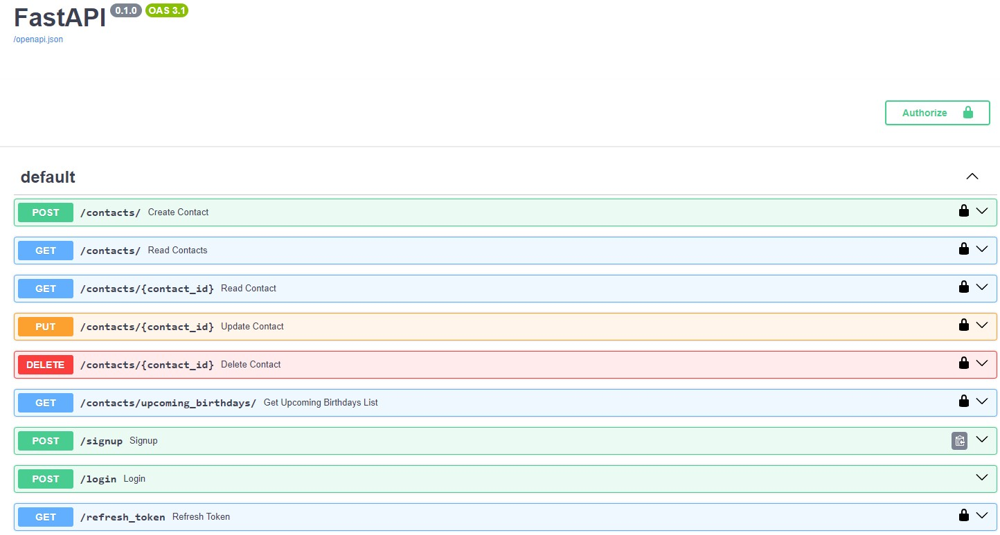

## Домашнє завдання #12
    
## Завдання (попереднє #11)
  
Мета цього домашнього завдання — створити REST API для зберігання та управління контактами. API повинен бути побудований з використанням інфраструктури FastAPI та використовувати SQLAlchemy для управління базою даних.  

Контакти повинні зберігатися в базі даних та містити в собі наступну інформацію:  
* Ім'я
* Прізвище
* Електронна адреса
* Номер телефону
* День народження
* Додаткові дані (необов'язково)


API повинен мати можливість виконувати наступні дії:  
* Створити новий контакт
* Отримати список всіх контактів
* Отримати один контакт за ідентифікатором
* Оновити існуючий контакт
* Видалити контакт


На придачу до базового функціоналу CRUD API також повинен мати наступні функції:   

* Контакти повинні бути доступні для пошуку за іменем, прізвищем чи адресою електронної пошти (Query).     
* API повинен мати змогу отримати список контактів з днями народження на найближчі 7 днів.    
  
  
## Завдання (#12)

* реалізуйте механізм аутентифікації в застосунку;   
* реалізуйте механізм авторизації за допомогою JWT токенів, щоб усі операції з контактами проводились лише зареєстрованими користувачами;
* користувач має доступ лише до своїх операцій з контактами.


## Загальні вимоги

* При реєстрації, якщо користувач вже існує з таким email, сервер поверне помилку HTTP 409 Conflict;
* Сервер хешує пароль і не зберігає його у відкритому вигляді в базі даних;
* У разі успішної реєстрації користувача сервер повинен повернути HTTP статус відповіді 201 Created та дані нового користувача;
* Для всіх операцій POST створення нового ресурсу, сервер повертає статус 201 Created;
* При операції POST - аутентифікація користувача, сервер приймає запит із даними користувача (email, пароль) у тілі запиту;
* Якщо користувач не існує або пароль не збігається, повертається помилка HTTP 401 Unauthorized;
* механізм авторизації за допомогою JWT токенів реалізований парою токенів: токена доступу access_token і токен оновлення refresh_token.


### Порядок виконання

Щоб підняти докер-контейнер з PostgreSQL і створити в ньому базу даних postgres:  

```
docker run --name db-postgres -p 5432:5432 -e POSTGRES_PASSWORD=567234 -d postgres  
```

Щоб запустити віртуальне середовище і запустити [Swagger документацію RESTful API](http://127.0.0.1:8000/docs):    

```cd contact_api```   
```poetry shell```    
```cd contact_api```    
```uvicorn main:app --host localhost --port 8000 --reload```    

На сторінці документації потрібно зареєструуватися в розділі документації ```POST /signup```. Наприклад:  
```  
{    
"username": "elen_de2",  
"email": "alenka@gmail.com",    
"password": "Alenka2004"  
}  
```

Відповідь сервера:  
  
Code	Details  
201	  
Response body 
{  
  "user": {  
    "id": 2,  
    "username": "elen_de2",  
    "email": "alenka@gmail.com",  
    "created_at": ...,  
    "avatar": ...  
  },  
  "detail": "User successfully created"  
}  
  
Далі в розділі ```POST /login``` залогінітися:  
  
username -> alenka@gmail.com  
password -> Alenka2004  
client_id -> 2 (з Response body "user" -> "id")  
client_secret -> secret (будь-який рядок)
  
Далі авторизуємося з цими даними і все можемо виконувати різні операції з контактами.  
   
На сторінці документації можна створити контакти. Для цього перейдемо в розділ ```POST /contacts/ Create contacts``` і додамо наступні контакти:
```
  {
    "first_name": "Nina",
    "last_name": "Dobrev",
    "email": "nina12@gmail.com",
    "phone_number": "380995678945",
    "birthday": "2001-04-06",
    "additional_data": "Actress",
    "id": 18
  }
```
```
  {
    "first_name": "Mark",
    "last_name": "Kingston",
    "email": "markkng@gmail.com",
    "phone_number": "380677453892",
    "birthday": "1995-04-10",
    "additional_data": "-",
    "id": 19
  }
```
```
  {
    "first_name": "Kai",
    "last_name": "Parker",
    "email": "kaipark@gmail.com",
    "phone_number": "380667453899",
    "birthday": "2024-03-31",
    "additional_data": "-",
    "id": 20
  }
```

Далі в розділі ```GET /contacts/ Read Contacts``` можна отримати всі контакти, або ж якщо ввести в пошуковий запит ```query``` ім'я, прізвище чи електронну адресу - отримати шуканий контакт, якщо такий існує в базі даних.  
  
Далі в розділі ```GET /contacts/{contact_id} Read Contact``` можна за ідентифікатором знайти необхідний контакт.  
     
Далі в розділі ```PUT /contacts/{contact_id} Update Contact``` можна за ідентифікатором знайти необхідний контакт і оновити його дані.  
  
Далі в розділі ```DELETE /contacts/{contact_id} Delete Contact``` можна за ідентифікатором видалити контакт.

Далі в розділі ```GET /contacts/upcoming_birthdays/ Get Upcoming Birthdays List``` можна отримати список контактів з днями народження на найближчі 7 днів:

```
Code	Details  
200	  
Response body  
Download  
[  
  {  
    "first_name": "Nina",  
    "last_name": "Dobrev",  
    "email": "nina12@gmail.com",  
    "phone_number": "380995678945",  
    "birthday": "2001-04-06",  
    "additional_data": "Actress",  
    "id": 18  
  },
  {
    "first_name": "Kai",  
    "last_name": "Parker",  
    "email": "kaipark@gmail.com",  
    "phone_number": "380667453899",  
    "birthday": "2024-03-31",  
    "additional_data": "-",  
    "id": 20  
  }  
]  
Response headers  
 content-length: 315   
 content-type: application/json   
 date: Sun,31 Mar 2024 17:13:46 GMT   
 server: uvicorn   
```

## Результат   

[Swagger документація RESTful API:](http://127.0.0.1:8000/docs)  
  

