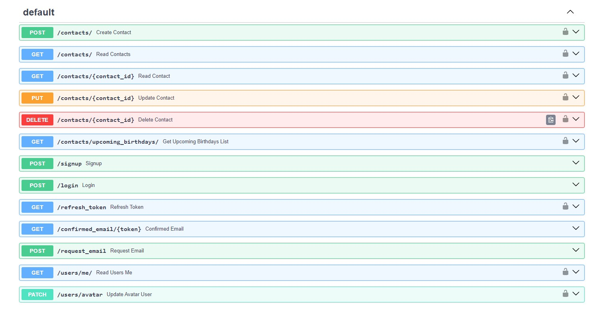

## Домашнє завдання #13
    
## Завдання 

У цьому домашньому завданні ми продовжуємо доопрацьовувати застосунок REST API із домашнього завдання 12. 

* Реалізуйте механізм верифікації електронної пошти зареєстрованого користувача;
* Обмежуйте кількість запитів до своїх маршрутів контактів. Обов’язково обмежте швидкість - створення контактів для користувача;
* Увімкніть CORS для свого REST API;
* Реалізуйте можливість оновлення аватара користувача. Використовуйте сервіс Cloudinary;


Загальні вимоги

* Усі змінні середовища повинні зберігатися у файлі .env. Всередині коду не повинно бути конфіденційних даних у «чистому» вигляді;
* Для запуску всіх сервісів і баз даних у застосунку використовується Docker Compose;


Додаткове завдання

* Реалізуйте механізм кешування за допомогою бази даних Redis. Виконайте кешування поточного користувача під час авторизації;
* Реалізуйте механізм скидання паролю для застосунку REST API;


### Порядок виконання

Щоб підняти докер-контейнер з PostgreSQL і створити в ньому базу даних postgres, а також redis:  

```
docker-compose up -d 
```

Щоб запустити віртуальне середовище і запустити [Swagger документацію RESTful API](http://127.0.0.1:8000/docs):    

```cd contact_api```   
```poetry shell```    
```cd contact_api```    
```uvicorn main:app --reload```    

На сторінці документації потрібно зареєструуватися в розділі документації ```POST /signup```. Наприклад:  
```  
{
  "username": "elen_de12",
  "email": "rojifi7309@etopys.com",
  "password": "Alenka2001"
}
```

Відповідь сервера:  
  
Code	Details  
201	  
Response body 
{
  "user": {
    "id": 1,
    "username": "elen_de12",
    "email": "rojifi7309@etopys.com",
    "created_at": "2024-04-12T09:13:11.418020",
    "avatar": "https://www.gravatar.com/avatar/46fdce281fe6f8d680b783e6c96659ba"
  },
  "detail": "User successfully created. Check your email for confirmation."
}
  
При реєстрації користувача, йому на пошту надсилається лист для підтвердження пошти. При переході за посиланням ми отримаємо сторінку з таким вмістом:  
```
{  
  "detail": "Not authenticated"  
}  
```
  
Але при перевірці в розділі ```GET confirmed_email/{token} Confirmed email``` при вставці токена з посилання з листа ```http://127.0.0.1:8000/confirmed_email/{token} ```
нам показує наступну відповідь:  
```  
{  
  "message": "Your email is already confirmed"  
}  
```
  
Далі в розділі ```POST /login``` можна залогінітися:  
  
username -> rojifi7309@etopys.com  
password -> Alenka2001 
client_id -> 1 (з Response body "user" -> "id") 
  
Далі авторизуємося з цими даними і все можемо виконувати різні операції з контактами.  
   
На сторінці документації можна створити контакти. Для цього перейдемо в розділ ```POST /contacts/ Create contacts``` і додамо наступні контакти:
```
  {
    "first_name": "Nina",
    "last_name": "Dobrev",
    "email": "nina12@gmail.com",
    "phone_number": "380995678945",
    "birthday": "2001-04-06",
    "additional_data": "Actress",
    "id": 18
  }
```
```
  {
    "first_name": "Mark",
    "last_name": "Kingston",
    "email": "markkng@gmail.com",
    "phone_number": "380677453892",
    "birthday": "1995-04-10",
    "additional_data": "-",
    "id": 19
  }
```
```
  {
    "first_name": "Kai",
    "last_name": "Parker",
    "email": "kaipark@gmail.com",
    "phone_number": "380667453899",
    "birthday": "2024-03-31",
    "additional_data": "-",
    "id": 20
  }
```

Далі в розділі ```GET /contacts/ Read Contacts``` можна отримати всі контакти, або ж якщо ввести в пошуковий запит ```query``` ім'я, прізвище чи електронну адресу - отримати шуканий контакт, якщо такий існує в базі даних.  
  
Далі в розділі ```GET /contacts/{contact_id} Read Contact``` можна за ідентифікатором знайти необхідний контакт.  
     
Далі в розділі ```PUT /contacts/{contact_id} Update Contact``` можна за ідентифікатором знайти необхідний контакт і оновити його дані.  
  
Далі в розділі ```DELETE /contacts/{contact_id} Delete Contact``` можна за ідентифікатором видалити контакт.

Далі в розділі ```GET /contacts/upcoming_birthdays/ Get Upcoming Birthdays List``` можна отримати список контактів з днями народження на найближчі 7 днів:

Також можна переглянути інформацію про профіль в розділі ```GET users/me/ READ users me```:
```
{  
  "id": 1,  
  "username": "elen_de12",  
  "email": "rojifi7309@etopys.com",  
  "created_at": "2024-04-12T09:13:11.418020",  
  "avatar": "https://res.cloudinary.com/deqe1bffb/image/upload/c_fill,h_250,w_250/v1712913396/elen_de12"  
}
```

В розділі ```PATCH /users/avatar Update Avatar User``` можна оновити аватар на файл з комп'ютеру. Далі цей файл збережеться на хмарі і в інформації про профіль буде посилання на нього.

## Результат   

[Swagger документація RESTful API:](http://127.0.0.1:8000/docs)  
  

