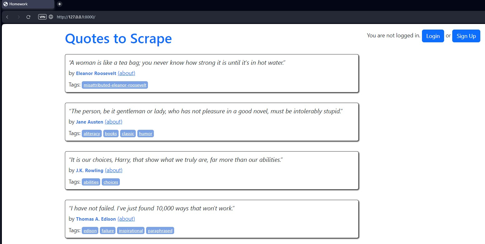
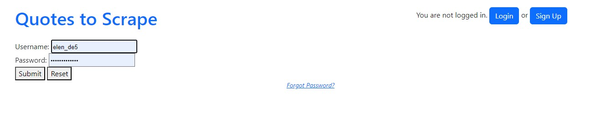
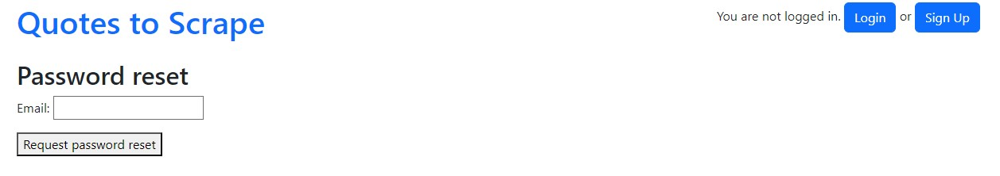
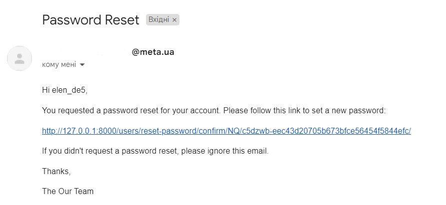
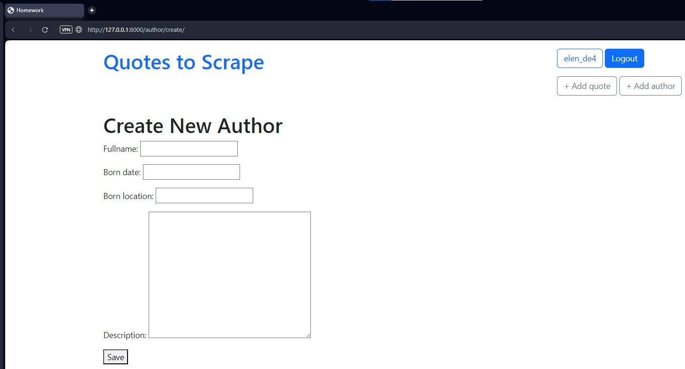
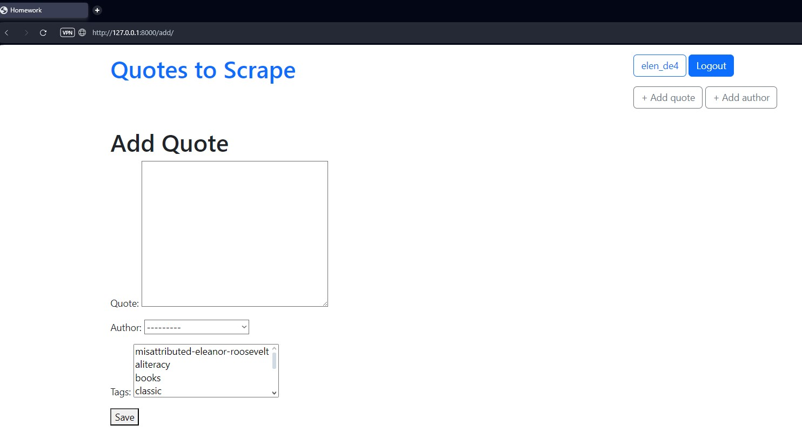
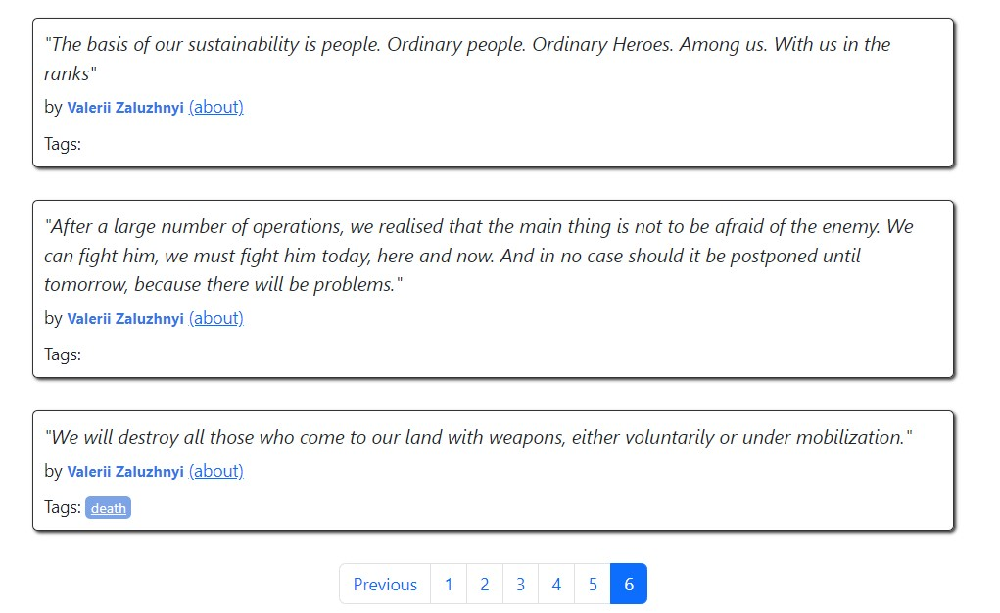

## Домашнє завдання #13
   
## Завдання 2

У цьому домашньому завданні необхідно доопрацювати застосунок Django із домашнього завдання 10.  

* Реалізуйте механізм скидання паролю для зареєстрованого користувача;
* Усі змінні середовища повинні зберігатися у файлі .env та використовуватися у файлі settings.py

### Порядок виконання

Щоб запустити віртуальне середовище і запустити [сервер](http://127.0.0.1:8000/):    
```cd project_poetry```  
```poetry shell```  
```cd hw10_project```  
```py .\manage.py runserver```  

## Результат   
  
Головна сторінка сайту з цитатами без авторизації:  
  

Сторінка логінізації на сайт:  
  

Сторінка збросу пароля:  
   

Лист з переходом на сторінку для збросу пароля:  
   

Сторінка для додавання нового автора:   
  

Сторінка для додавання нової цитати:  
  

Останні цитати з новим автором:  
  
