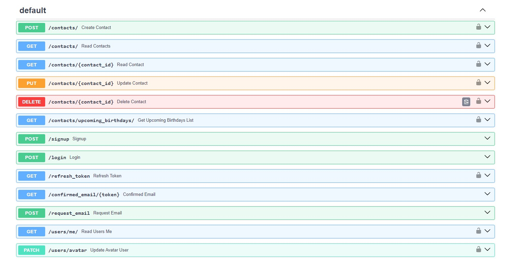
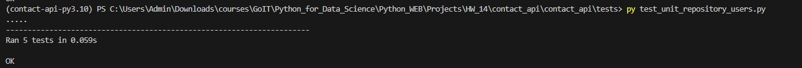
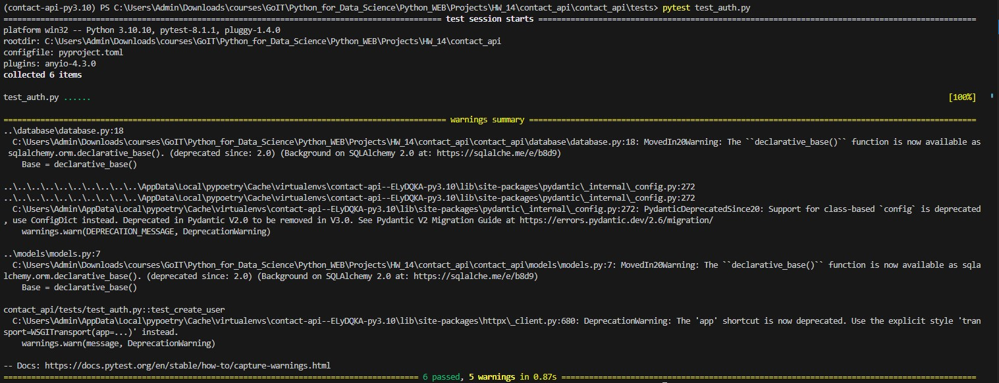

## Домашнє завдання #14
    
## Завдання 

У цьому домашньому завданні ми продовжуємо доопрацьовувати наш REST API застосунок із домашнього завдання 13.  

* За допомогою Sphinx створіть документацію для вашого домашнього завдання. Для цього додайте в основних модулях до необхідних функцій і методів класів рядки docstrings.
* Покрийте модульними тестами модулі репозиторію домашнього завдання, використовуючи фреймворк Unittest. За основу візьміть приклад із конспекту для модуля ```tests/test_unit_repository_notes.py```
* Покрийте функціональними тестами будь-який маршрут на вибір з вашого домашнього завдання, використовуючи фреймворк pytest.
  
Додаткове завдання  
  
* Покрийте ваше домашнє завдання тестами більш ніж на 95%. Для контролю використовуйте пакет pytest-cov


### Порядок виконання

Щоб підняти докер-контейнер з PostgreSQL і створити в ньому базу даних postgres, а також redis:  

```
docker-compose up -d 
```

Щоб запустити віртуальне середовище і запустити [Swagger документацію RESTful API](http://127.0.0.1:8000/docs):    

```cd contact_api```   
```poetry shell```    
```cd contact_api```    
```uvicorn main:app --reload```    

## Результат   
  
Документація створена за допомогою Sphinx:  

  
Результат виконання тестів за допомогою фреймворку Unittest:  

  
Результат виконання тестів за допомогою фреймворку pytest:  
